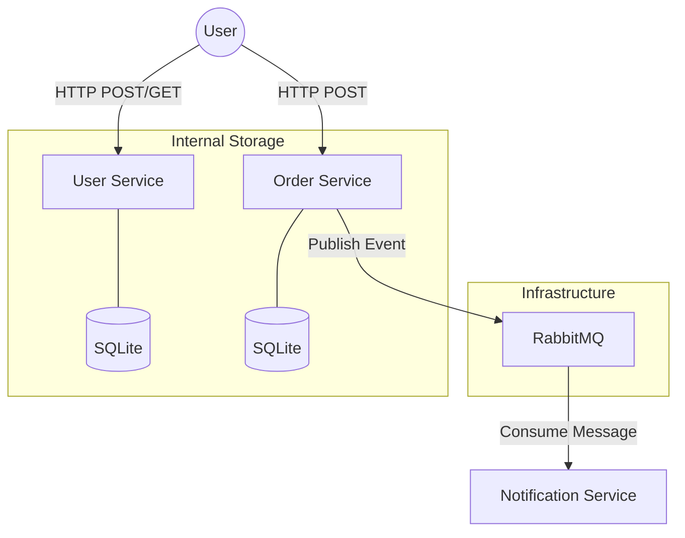

# Mini E-commerce Microservices

A robust demonstration of an **Event-Driven Microservices Architecture** built with Python, FastAPI, RabbitMQ, and Docker.

This project showcases how independent services communicate asynchronously to handle e-commerce workflows like user registration, order placement, and real-time notifications.

---

## 🏗️ Architecture Overview

The system consists of three independent microservices and a message broker. They communicate through a mix of synchronous REST APIs and asynchronous event publishing.



### 1. User Service (Port 5001)
- **Role**: Manages user profiles and identity.
- **Tech**: FastAPI, Async SQLAlchemy, SQLite.
- **Key Feature**: Validates email uniqueness and handles user registration.

### 2. Order Service (Port 5002)
- **Role**: Handles the lifecycle of an order.
- **Tech**: FastAPI, Async SQLAlchemy, RabbitMQ (aio-pika).
- **Key Feature**: When an order is successfully created, it publishes an `order_created` event to RabbitMQ.

### 3. Notification Service (Consumer)
- **Role**: Reacts to system events to "notify" users.
- **Tech**: Python, aio-pika.
- **Key Feature**: Runs as a background worker. It consumes messages from the `order_events` queue and logs details to the console.

---

## 🛠️ Technology Stack

- **Framework**: [FastAPI](https://fastapi.tiangolo.com/) (High-performance Python web framework)
- **Message Broker**: [RabbitMQ](https://www.rabbitmq.com/) (Reliable asynchronous messaging)
- **ORM**: [SQLAlchemy 2.0](https://www.sqlalchemy.org/) (Async support)
- **Database**: SQLite (Local file-based for simplicity)
- **Containerization**: Docker & Docker Compose
- **Async Client**: [aio-pika](https://aiopika.readthedocs.io/) (RabbitMQ) & [httpx](https://www.python-httpx.org/) (Testing)

---

## 🚀 Getting Started

### Prerequisites
- [Docker Desktop](https://www.docker.com/products/docker-desktop/)
- Python 3.12+ (Only if running tests or development locally)

### Deployment

1. **Clone the repository**:
   ```bash
   git clone https://github.com/hadithedetonator/ecommerce-microservices.git
   cd ecommerce-microservices
   ```

2. **Spin up the infrastructure**:
   ```bash
   docker-compose up --build
   ```

3. **Verify running containers**:
   ```bash
   docker-compose ps
   ```

4. **Access RabbitMQ Dashboard**:
   - URL: [http://localhost:15672](http://localhost:15672)
   - Credentials: `guest` / `guest`

---

## 🧪 Testing the Flow (Step-by-Step)

To verify that the services are working together correctly, follow this sequence:

### 1. Automatic Integration Test
I have provided an async script that simulates the entire user-to-order flow.

```bash
# Setup virtual environment
python3 -m venv tests/venv
source tests/venv/bin/activate
pip install -r tests/requirements.txt

# Run the test
python tests/test_flow.py
```

### 2. Manual Verification Sequence
You can also test using `curl` or Postman:

1. **Step 1: Create a User**
   ```bash
   curl -X POST http://localhost:5001/users \
     -H "Content-Type: application/json" \
     -d '{"name": "John Doe", "email": "john@example.com"}'
   ```

2. **Step 2: Place an Order**
   ```bash
   curl -X POST http://localhost:5002/orders \
     -H "Content-Type: application/json" \
     -d '{"user_id": 1, "product_name": "MacBook Pro", "amount": 2499.99}'
   ```

3. **Step 3: Check Notifications**
   Watch the docker logs to see the event being consumed:
   ```bash
   docker-compose logs -f notification_service
   ```
   *Expected Output:* `[!] NOTIFICATION: Order #1 created for User 1: MacBook Pro ($2499.99)`

---

## 📂 Project Structure

```text
.
├── docker-compose.yml          # Orchestration
├── user_service/               # User Management API
├── order_service/              # Order Management API (Publisher)
├── notification_service/       # Event Consumer (Worker)
├── tests/                      # Integration test suite
└── readme.md                   # Documentation
```

---

## 🤝 Contributing
Feel free to open issues or submit pull requests to enhance the functionality!
